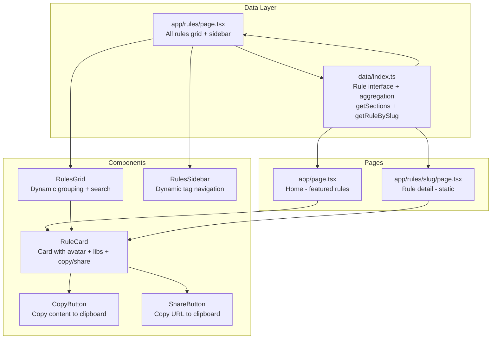

# Migration Plan: cursor.directory → glm-catalog

## Goal
Migrate all rules data (~60+ rule files) and their associated components from `cursor.directory` into `glm-catalog`, adapting the UI to work without Redis (local/static only).

---

## What We're Migrating

### Data
- **~60+ rule files** from `cursor.directory/src/data/rules/*.ts` → `data/rules/`
- **Data aggregator** (`data/index.ts`) with `Rule` interface, `rules` array, `getSections()`, `getRuleBySlug()`

### Components
- **RuleCard** — enhanced with author avatar, libs popover, copy/share buttons, link to detail page
- **CopyButton** — copy rule content to clipboard (without Redis voting)
- **ShareButton** — copy rule URL to clipboard
- **RulesGrid** — dynamic tag grouping from data instead of hardcoded tags
- **RulesSidebar** — dynamic tag list computed from `getSections()`

### Pages
- **Rule detail page** — `app/rules/[slug]/page.tsx` with `generateStaticParams` for static generation
- **Home page** — updated to use new data structure
- **Rules page** — updated to work with new data layer

### Utilities
- `isImageUrl()` and `generateNameAbbr()` added to `lib/utils.ts`

---

## What We're NOT Migrating (No Redis)

| Skipped | Reason |
|---------|--------|
| `src/lib/redis.ts` | No Redis — local project |
| `src/actions/vote-action.ts` | Depends on Redis |
| `src/actions/subscribe-action.ts` | Loops.so email — not needed |
| `src/actions/safe-action.ts` | Only used for voting |
| `src/data/popular.ts` | Depends on Redis vote counts |
| `src/app/api/*` | API routes not needed for static local site |
| `next-safe-action`, `@upstash/redis` | Dependencies not needed |

---

## Data Structure Change

### Old glm-catalog Rule interface
```typescript
interface Rule {
    id: string;       // "1", "2"
    title: string;
    tags: string[];
    content: string;
    author: string;   // simple string
}
```

### New Rule interface (from cursor.directory)
```typescript
interface Rule {
    title: string;
    slug: string;         // URL-friendly: "nextjs-react-redux-typescript-cursor-rules"
    tags: string[];
    libs: string[];       // related libraries: ["shadcn", "radix", "tailwind"]
    content: string;
    author?: {
        name: string;
        url: string | null;
        avatar: string | null;
    };
}
```

### Key differences
- `id` → `slug` (URL-friendly identifier)
- `author: string` → `author: { name, url, avatar }` (rich author info)
- Added `libs: string[]` (related libraries/tools)
- Removed hardcoded `ruleTags` array — tags are now computed dynamically

---

## Architecture After Migration



---

## Step-by-Step Implementation

### Step 1: Copy rule data files
- Copy all ~60+ `.ts` files from `cursor.directory/src/data/rules/` to `data/rules/`
- These files are self-contained — each exports an array of rules with the correct interface

### Step 2: Create `data/index.ts`
- Define the `Rule` interface
- Import all rule files from `data/rules/`
- Aggregate into a single `rules: Rule[]` array
- Export `getSections()` — dynamically groups rules by tags, sorted by count
- Export `getRuleBySlug(slug)` — finds a single rule by slug
- Remove the old `data/rules.ts` file (replaced by `data/index.ts` + `data/rules/*.ts`)

### Step 3: Update `lib/utils.ts`
- Add `isImageUrl(url: string): boolean` — checks if a string is an image URL
- Add `generateNameAbbr(name: string): string` — extracts first letter for avatar fallback

### Step 4: Install missing dependencies
- `sonner` — for toast notifications on copy/share
- Note: `lucide-react` is already installed (has Copy, Check, Share, ChevronDown icons)

### Step 5: Create `components/CopyButton.tsx`
- Copy content to clipboard on click
- Show check icon for 1 second after copying
- Show toast notification: "Copied to clipboard"
- NO Redis voting (unlike cursor.directory version)

### Step 6: Create `components/ShareButton.tsx`
- Copy rule URL to clipboard on click
- Show check icon for 1 second after copying
- Show toast notification: "URL copied to clipboard"

### Step 7: Update `components/RuleCard.tsx`
- Accept `Rule` prop with new interface (slug, author object, libs)
- Show author name + avatar (with fallback initial)
- Show libs as a popover (first 2 visible, "+N more" expands)
- Add CopyButton and ShareButton (visible on hover)
- Make the card content a link to `/rules/[slug]`
- Keep the dark theme styling consistent with glm-catalog design

### Step 8: Update `components/RulesGrid.tsx`
- Import from `data/index` instead of `data/rules`
- Use `getSections()` for dynamic grouping instead of hardcoded `ruleTags`
- Keep search functionality (filter by title, content, tags)
- Keep tab UI (All / Popular / Official) — "Popular" can be static for now
- Remove dependency on old `ruleTags` array

### Step 9: Update `components/RulesSidebar.tsx`
- Import `getSections()` from `data/index`
- Compute tags dynamically from sections instead of using hardcoded `ruleTags`
- Show dynamic count per tag
- Keep the sticky nav and click-to-filter behavior

### Step 10: Create `app/rules/[slug]/page.tsx`
- Use `generateStaticParams()` to pre-generate all rule pages
- Use `generateMetadata()` for SEO (title + description from rule)
- Show full RuleCard in page mode (expanded, full opacity)
- Handle 404 if slug not found
- Add `revalidate = 86400` for periodic regeneration

### Step 11: Update `app/page.tsx`
- Import from `data/index` instead of `data/rules`
- Use `getSections()` to show top sections on home page
- Show first 4 rules from top categories (TypeScript, GLM, etc.)
- Keep existing HeroSection, FeaturedMCPsRow, FeaturedJobsGrid

### Step 12: Update `app/rules/page.tsx`
- Import from `data/index` instead of `data/rules`
- Ensure selectedTag filtering works with new data structure
- Keep the sidebar + grid layout

### Step 13: Clean up
- Delete old `data/rules.ts` (replaced by `data/index.ts` + `data/rules/*.ts`)
- Verify no broken imports across the project
- Test all pages render correctly

---

## Files Changed Summary

| Action | File |
|--------|------|
| **COPY** ~60 files | `cursor.directory/src/data/rules/*.ts` → `data/rules/*.ts` |
| **CREATE** | `data/index.ts` |
| **MODIFY** | `lib/utils.ts` |
| **MODIFY** | `components/RuleCard.tsx` |
| **MODIFY** | `components/RulesGrid.tsx` |
| **MODIFY** | `components/RulesSidebar.tsx` |
| **CREATE** | `components/CopyButton.tsx` |
| **CREATE** | `components/ShareButton.tsx` |
| **CREATE** | `app/rules/[slug]/page.tsx` |
| **MODIFY** | `app/page.tsx` |
| **MODIFY** | `app/rules/page.tsx` |
| **DELETE** | `data/rules.ts` |
| **INSTALL** | `sonner` package |
